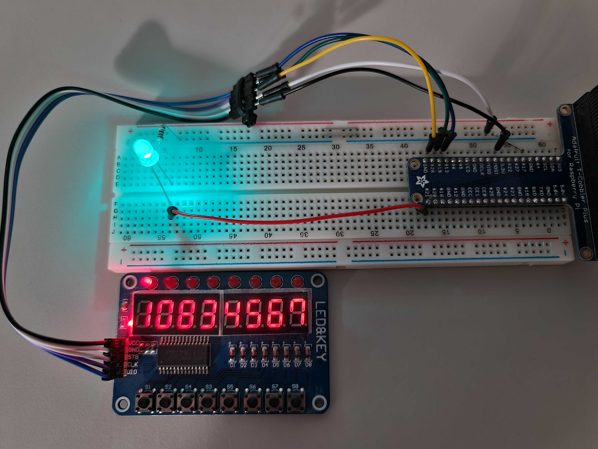
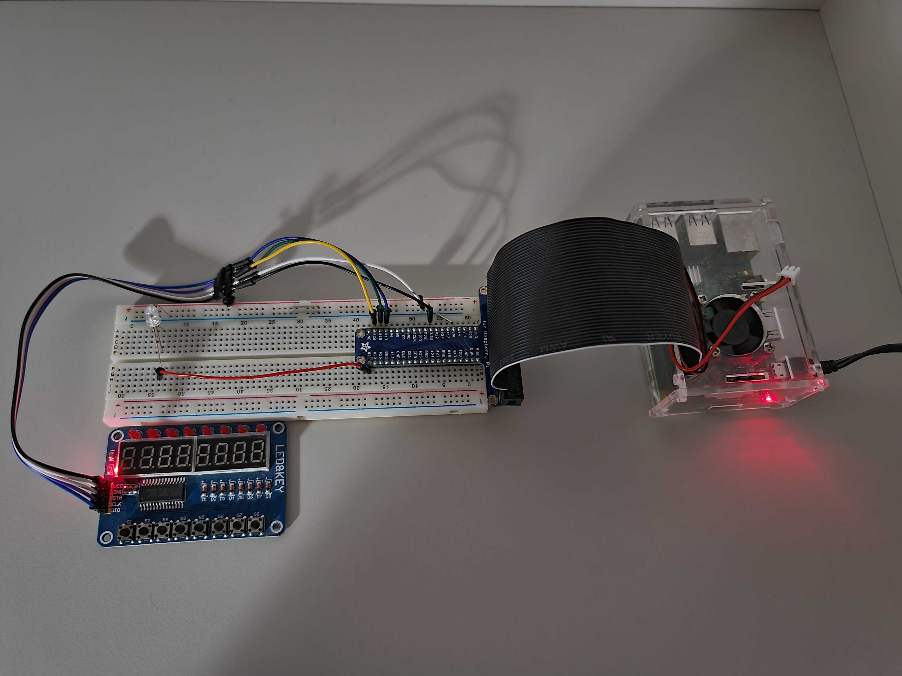
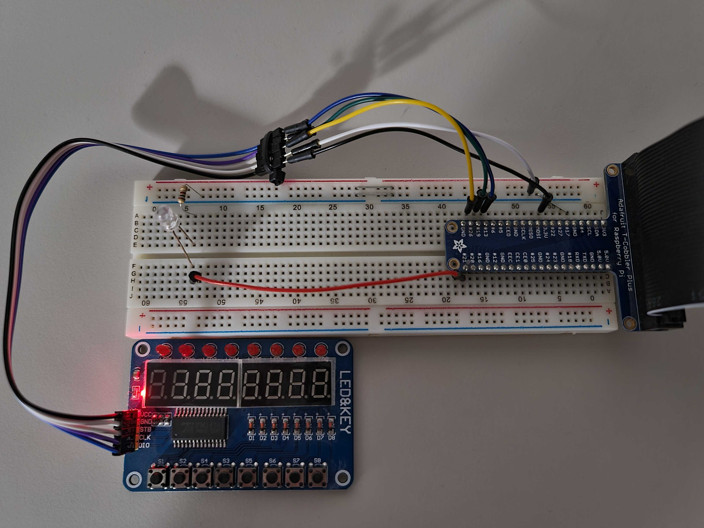
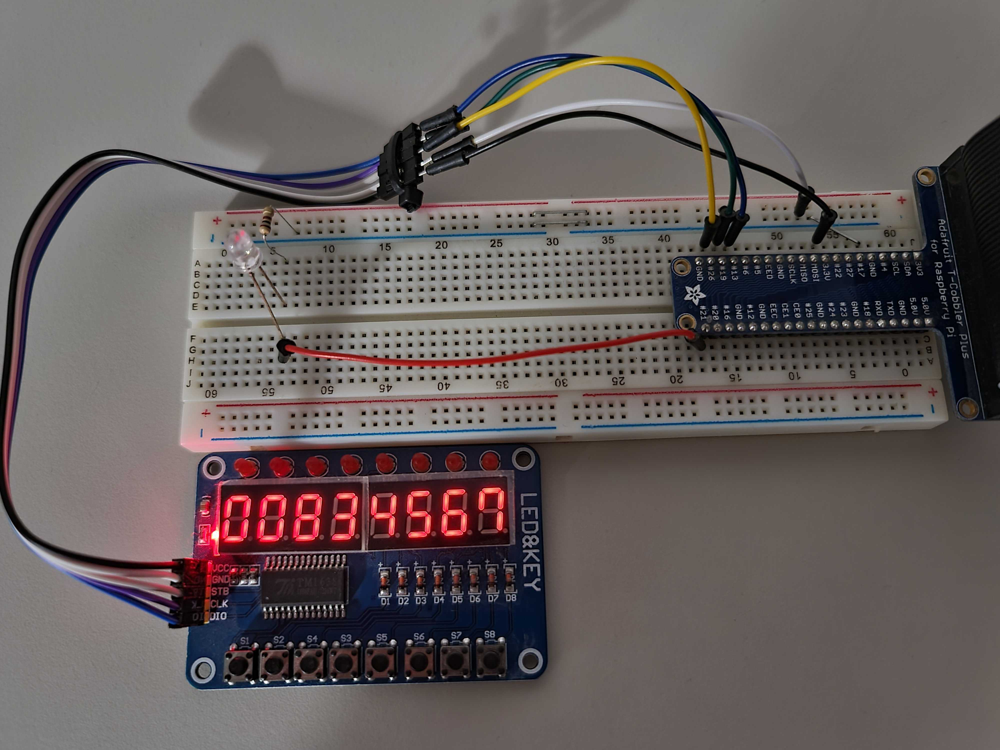

# RPi-TM1638

## Description

TM1638 Controller Boilerplate.

## Configuration

- Raspberry Pi Model 3B+
- TM1638 Controller
- Breadboard HQ (830)
- T-Cobbler Plus Adaptor
- 40-Pin (2x20) Flat Ribbon Cable Connector
- 3mm Led
- 100Ω Resistor
- Breadboard Cables / Jumpers

## Circuit

- Connect the T-Cobbler to Ribbon Cable and Breadboard
- Connect the remaining end of Ribbon Cable to RPi
- Connect TM1638 to T-Cobbler using the following pinout
  - VCC - 3.3V
  - GND - GND
  - STB - #22
  - CLK - #21
  - DIO - #17
- Add Led
- Attach the resistor to led
- Connect the led's remaining end to T-Cobbler
  - LED - #26

## Start the app

- `cd RPI-TM1638/`
- `python app.py`

